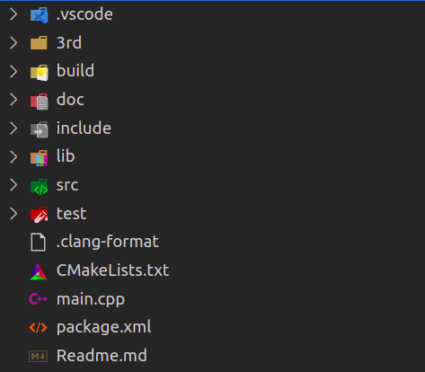

# 《论如何使用VS Code + Cmake进行C/C++项目开发》

直接开始

## 1. 项目目录结构

  

---------------------------------------------------------------------------------------------------------
|   目录名字    |                                     说明                                     |建议ignore|
|:------------:|:-----------------------------------------------------------------------------|:--------:|
|   .vscode    |VS Code项目配置文件存放目录，常包含c_cpp_properties.json、launch.json、tasks.json|   ✅    |
|     3rd      |第三方库文件存放目录                                                            |   ❌    |
|    build     |CMake项目编译配置和可执行文件存放目录，该文件夹一般不作为项目内容提交至Git仓库      |   ✅    |
|     doc      |项目文档(说明文档、图片、视频等)存放目录                                         |   ❌    |
|   include    |头文件(.hpp .h)存放目录                                                        |   ❌    |
|     src      |源文件(.cpp)存放目录                                                           |   ❌    |
|     lib      |生成的库文件存放目录                                                            |   ✅    |
|     test     |测试文件存放目录                                                                |   ❌    |
|.clang-format |clang-format工具配置文件                                                        |   ✅    |
|   main.cpp   |项目启动源文件                                                                  |   ❌    |
|  package.xml |ROS/ROS2项目专属配置文件，非ROS/ROS2项目不需要包含                                |   ❌    |
|CMakeLists.txt|CMake项目配置文件，必须包含                                                      |   ❌    |
|  Readme.md   |MarkDown格式的项目说明文档，文档内引用的图片存放在doc文件夹下，使用相对路径          |   ❌    |
-----------------------------------------------------------------------------------------------------------
以上只是常见的文件夹及文件，可根据项目需求添加自定义的文件夹或文件。

---

## 2. 开发环境配置
编译器 - CMake - VSCode
### 2.1 编译器配置

#### **Windows**

1. MinGW

- 下载

- 配置

- 调试

2. MSVC

- 下载

- 配置

- 调试

#### **Linux**

### 2.2 CMake配置

### 2.3 VSCode配置

### 2.3.1 VSCode下载
官网下载：https://code.visualstudio.com/Download

### 2.3 VSCode插件安装
- C/C++ Extension Pack：C++开发套件
- CMake & CMake Tools：CMake项目开发套件
- Doxygen Documentation Generator：快速生成代码注释模板，简单易用
- Clang-Format：按照.clang-format配置文件快速格式化代码

